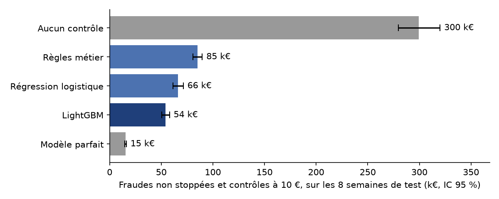
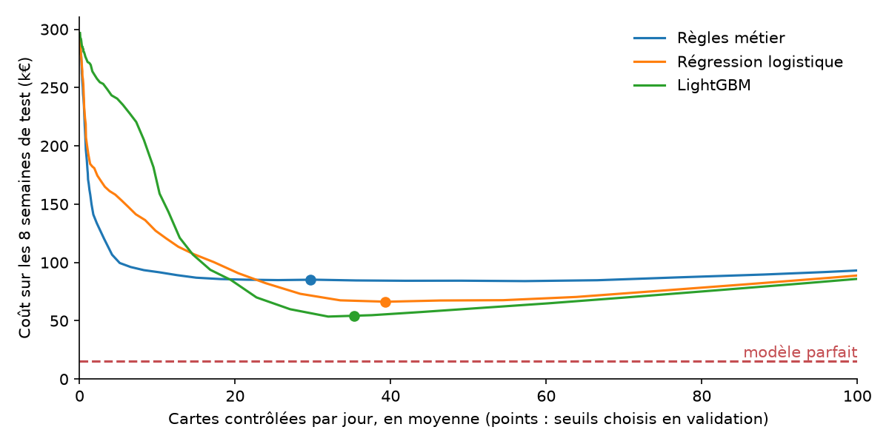
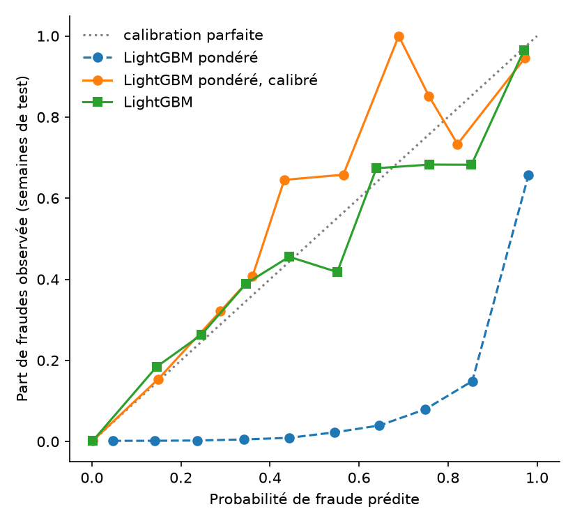
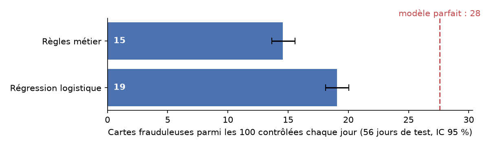
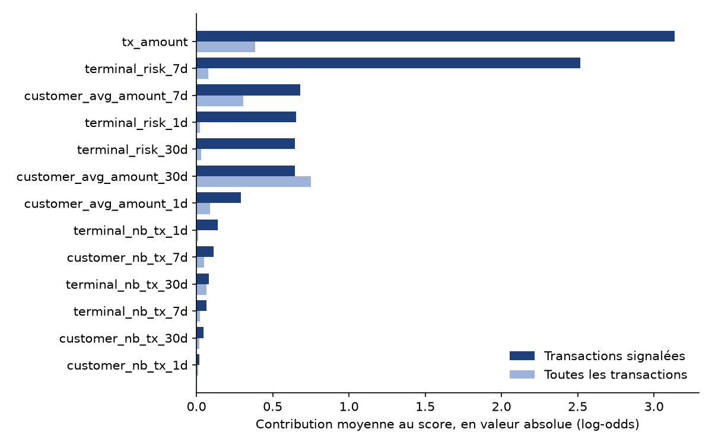
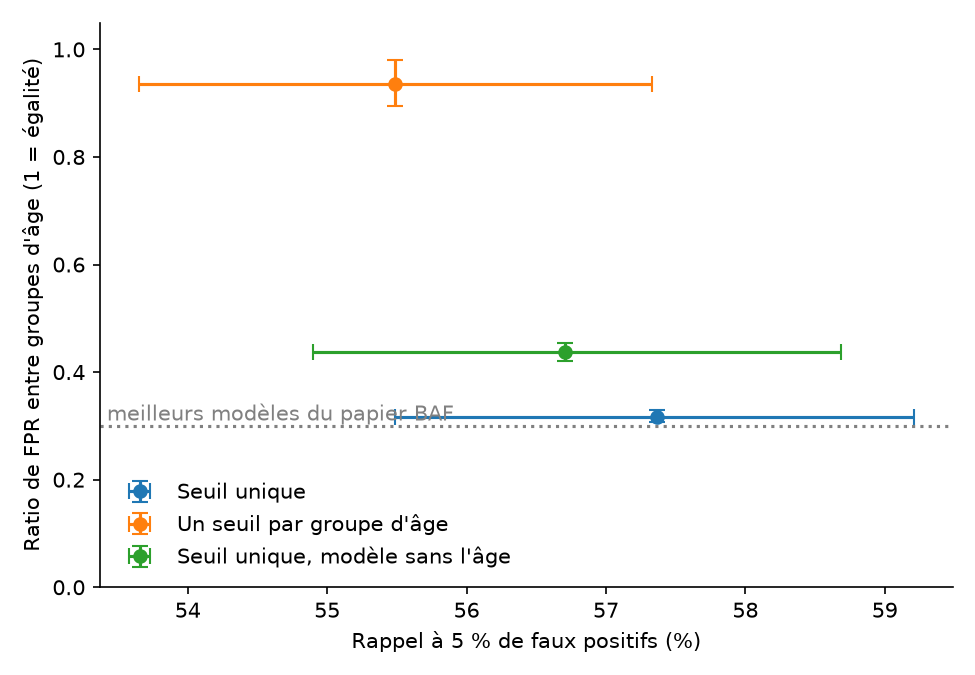
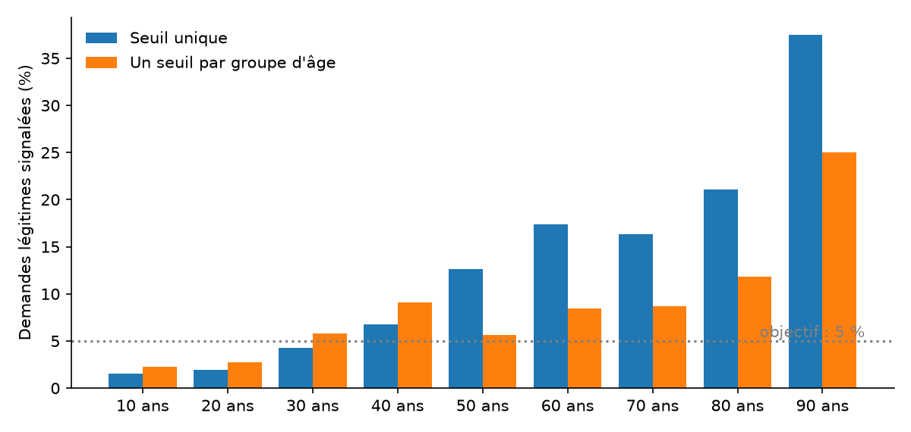
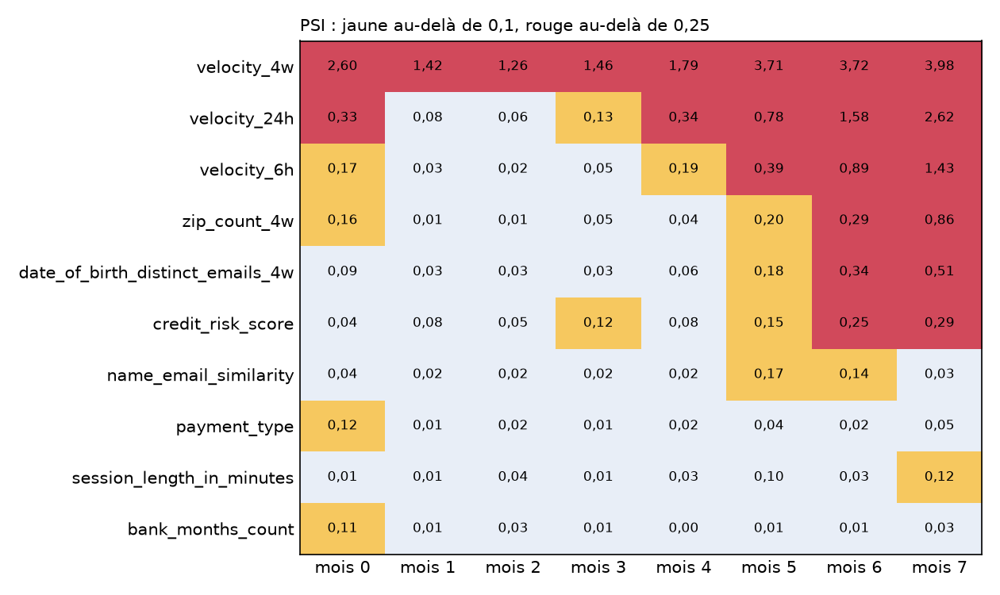

# FraudOps

[](https://github.com/MohamedRadhi52/fraudops/actions/workflows/ci.yml)

Détection de fraude bancaire évaluée comme en production, sur deux jeux complémentaires : des transactions carte simulées d'après le Fraud Detection Handbook (ULB) et des ouvertures de compte (BAF, Feedzai, NeurIPS 2022). **[Lire le rapport en ligne](https://mohamedradhi52.github.io/fraudops/)**



| Fraude carte | Card Precision@100 | AUC-PR | Coût sur 8 semaines |
|---|---|---|---|
| Règles métier | 14,6 % [13,7 ; 15,6] | 0,37 [0,35 ; 0,39] | 85,2 k€ [80,7 ; 89,7] |
| Régression logistique | 19,1 % [18,1 ; 20,1] | 0,61 [0,58 ; 0,63] | 66,3 k€ [61,4 ; 71,3] |
| **LightGBM** | **19,5 %** [18,5 ; 20,5] | **0,66** [0,65 ; 0,68] | **54,0 k€** [50,4 ; 58,0] |
| Modèle parfait | 27,6 % | 1 | 15,4 k€ [14,8 ; 16,2] |

| Ouverture de compte (BAF) | Rappel, seuil fixé en validation | Ratio de faux positifs selon l'âge |
|---|---|---|
| LightGBM | 57,4 % [55,5 ; 59,2] | 0,32 [0,31 ; 0,33] |
| LightGBM, un seuil par groupe d'âge | 55,5 % [53,6 ; 57,3] | 0,94 [0,90 ; 0,98] |
| LightGBM sans la variable d'âge | 56,7 % [54,9 ; 58,7] | 0,44 [0,42 ; 0,45] |

Intervalles de confiance à 95 % par bootstrap. La Card Precision@100 est la part de vraies fraudes parmi les 100 cartes contrôlées chaque jour ; le coût additionne 10 € par carte contrôlée et le montant des fraudes non stoppées. Un ratio de faux positifs de 1 signifie que les demandeurs de 50 ans et plus et les autres sont signalés à tort aussi souvent.

**Ce qu'il faut retenir.**

- **Un coût divisé par 5,5.** Avec un seuil choisi pour minimiser le coût, LightGBM ramène le coût de la fraude carte de 300 k€ à 54 k€ sur 8 semaines, en contrôlant 35 cartes par jour sur les 100 possibles.
- **Presque tout ce qui échappe est indétectable.** LightGBM stoppe 95 à 100 % des fraudes repérables ; il manque surtout celles d'un terminal compromis dont aucune fraude n'est encore connue.
- **Des probabilités fiables.** Contrôler une carte dès que probabilité × montant dépasse 10 € coûte 52 k€, sans aucun seuil à régler ; avec une pondération des classes, le même modèle coûterait 91 k€.
- **Le résultat du papier BAF est retrouvé.** Avec un seuil unique, les demandeurs de 50 ans et plus sont signalés à tort trois fois plus souvent que les autres (ratio de 0,32). Un seuil par groupe ramène le ratio à 0,94 pour 1,9 point de rappel ; retirer l'âge ne suffit pas (0,44), car d'autres variables portent la même information.

## Méthode

- **Validation préquentielle.** Chaque semaine, le modèle est ré-entraîné sur les 28 derniers jours dont les étiquettes sont connues, puis score la semaine suivante. Quatre semaines de validation servent à tous les réglages, huit semaines de test aux résultats.
- **Pas de fuite.** Les features du terminal ignorent les 7 derniers jours, dont les étiquettes ne sont pas encore connues, et deux tests le vérifient. Une carte dont une fraude est connue est bloquée : le modèle est jugé sur les fraudes que la banque ne connaît pas encore.
- **Décision métier.** Le seuil minimise le coût sous la contrainte de 100 contrôles par jour ; les probabilités sont vérifiées par une courbe de fiabilité.
- **BAF dans GitHub Actions.** Sa licence interdit l'usage commercial : un workflow le télécharge, entraîne, évalue, audite l'équité et la dérive, puis publie seulement les résultats.

Outils : pandas, DuckDB, PySpark, scikit-learn, LightGBM, MLflow, Fairlearn, FastAPI, Docker, pytest, GitHub Actions.

## Détails

<details>
<summary><b>Seuil et coût</b></summary>



Pour chaque modèle, le seuil d'alerte qui minimise le coût est choisi sur les semaines de validation, puis appliqué tel quel aux semaines de test (`make cost`). Les cartes au-dessus du seuil sont contrôlées, dans la limite de 100 par jour.

| Stratégie | Coût sur 8 semaines | Contrôles par jour |
|---|---|---|
| Aucun contrôle | 299,6 k€ [279,8 ; 320,1] | 0 |
| LightGBM, 100 contrôles chaque jour | 85,9 k€ [82,9 ; 89,2] | 100 |
| LightGBM, seuil de 0,08 | 54,0 k€ [50,4 ; 58,0] | 35 |

**Le seuil que je recommande : 0,08 sur la probabilité donnée par LightGBM.** Il divise le coût par 5,5 par rapport à l'absence de contrôle et économise 32 k€ sur 8 semaines par rapport à l'usage systématique des 100 contrôles : au-dessous de ce seuil, une carte a trop peu de chances d'être frauduleuse pour justifier un contrôle à 10 €. Il n'utilise qu'un tiers de la capacité. Le reste absorbe les pics de fraude et peut servir à des contrôles aléatoires, le seul moyen de mesurer la fraude que le modèle ne voit pas. Deux réserves : ce seuil dépend de l'hypothèse de 10 € par contrôle, et il doit être recalculé à chaque ré-entraînement, car il repose sur la distribution des scores.

Sous 15 contrôles par jour, les règles métier font mieux que LightGBM : elles traitent d'abord les gros montants, alors que LightGBM classe les cartes par probabilité de fraude, sans tenir compte du montant en jeu.

</details>

<details>
<summary><b>Calibration</b></summary>



Un score qui alimente une décision doit être une vraie probabilité. C'est ce qui permet de contrôler une carte quand sa perte attendue, probabilité × montant, dépasse le coût d'un contrôle, sans chercher de seuil. La calibration isotonique est ajustée sur les semaines de validation (`make calibration`).

| Variante | Score de Brier | Probabilité moyenne | Coût avec la règle de perte attendue |
|---|---|---|---|
| LightGBM | 0,00296 | 0,66 % | 52,0 k€ [48,5 ; 55,7], 28 contrôles par jour |
| LightGBM pondéré | 0,02174 | 10,90 % | 91,3 k€ [87,7 ; 94,9], 100 contrôles par jour |
| LightGBM pondéré, calibré | 0,00314 | 0,63 % | 53,5 k€ [49,8 ; 57,4], 30 contrôles par jour |

Les semaines de test comptent 0,64 % de fraudes. Entraîné sans pondération des classes, LightGBM est déjà bien calibré : la calibration isotonique ne change presque rien (score de Brier de 0,00297), et la règle de perte attendue coûte 52,0 k€, un peu moins que le seuil optimisé de la section précédente, sans aucun réglage. Elle corrige aussi le défaut vu plus haut à faible volume, puisqu'elle tient compte du montant en jeu. Pondérer les classes, une pratique courante contre le déséquilibre, gonfle les probabilités : la règle contrôle alors 100 cartes par jour et coûte 91 k€. Une calibration ajustée sur la validation ramène ces probabilités au bon niveau (53,5 k€). D'où la règle retenue : pas de pondération ni de SMOTE, et une calibration vérifiée à chaque nouveau modèle.

</details>

<details>
<summary><b>Détection : ce qui est stoppé et ce qui échappe</b></summary>



Avec LightGBM, l'équipe trouve en moyenne 19,5 cartes frauduleuses parmi les 100 cartes qu'elle contrôle chaque jour, contre 27,6 pour un modèle parfait. Part des fraudes stoppées, c'est-à-dire dont la carte est contrôlée le jour même ou déjà bloquée :

| Scénario | Fraudes stoppées |
|---|---|
| 1. Montant supérieur à 220 € | 100 % |
| 2. Terminal compromis, fraude déjà connue sur ce terminal | 95 % |
| 2. Terminal compromis, aucune fraude encore connue | 8 % |
| 3. Client compromis | 98 % |

</details>

<details>
<summary><b>Ce que le modèle regarde (SHAP)</b></summary>



Valeurs SHAP du modèle de production (`make explain`) : LightGBM entraîné sur les 28 derniers jours dont les étiquettes sont connues, puis expliqué sur la semaine suivante avec l'implémentation TreeSHAP de LightGBM.

- **Sur toutes les transactions**, le modèle regarde surtout l'habitude de dépense du client (montant moyen sur 7 et 30 jours) : c'est elle qui situe une transaction ordinaire.
- **Sur les 599 transactions qu'il signale** (72 % de fraudes), le montant et le taux de fraude du terminal sur 7 jours dominent : les signaux des scénarios de fraude.
- **Un exemple.** Une transaction de 913,60 € d'un client qui dépense en moyenne 216 € sur 30 jours : perte attendue de 851 €, donc contrôle. Ses trois raisons sont le montant, puis la dépense moyenne du client sur 7 jours et sur 1 jour, déjà gonflées par 7 autres fraudes de la semaine, encore inconnues à cause du délai d'étiquetage. L'API renvoie ces trois raisons avec chaque score.

**Limites.** SHAP explique le modèle, pas la fraude. Des variables corrélées se partagent le crédit de façon arbitraire : les taux de fraude du terminal sur 1, 7 et 30 jours portent en partie la même information. Et une variable peut en remplacer une autre, comme l'âge sur BAF : une explication qui ne cite pas une variable sensible ne prouve pas que le modèle l'ignore.

</details>

<details>
<summary><b>API de scoring et Docker</b></summary>

L'API reçoit les features d'une transaction, calculées en amont, et renvoie la probabilité de fraude, la perte attendue, la décision et les trois raisons principales du score. `make api` la lance en local, `make docker` dans son conteneur ; l'image est construite et testée dans la CI, et la documentation interactive est sur `/docs`.

```bash
curl -X POST localhost:8000/score -H "Content-Type: application/json" -d @tests/transaction.json
```

```json
{
  "probability": 0.932,
  "expected_loss": 851.49,
  "decision": "contrôler",
  "reasons": [
    {"feature": "tx_amount", "label": "montant de la transaction", "contribution": 6.71},
    {"feature": "customer_avg_amount_7d", "label": "montant moyen du client sur 7 jours", "contribution": 2.08},
    {"feature": "customer_avg_amount_1d", "label": "montant moyen du client sur 1 jour", "contribution": 0.54}
  ]
}
```

La carte est contrôlée quand la perte attendue, probabilité × montant, dépasse le coût d'un contrôle (10 €). Les contributions sont des valeurs SHAP en log-odds.

</details>

<details>
<summary><b>Ouverture de compte (BAF) et équité selon l'âge</b></summary>

Le jeu Bank Account Fraud (Feedzai, NeurIPS 2022) compte 1 million de demandes d'ouverture de compte sur 8 mois, dont 1 à 1,4 % de fraudes selon la période, avec des attributs sensibles comme l'âge. Sa licence interdit l'usage commercial : le workflow [`baf.yml`](.github/workflows/baf.yml) le télécharge avec un jeton Kaggle gardé en secret, entraîne et évalue les modèles, puis publie seulement les métriques et les figures dans [`reports/baf/`](reports/baf/RESULTS.md). Les données ne sont jamais dans le dépôt.

- **Protocole.** Entraînement sur les mois 0 à 4, arrêt précoce et seuil à 5 % de faux positifs sur le mois 5, test sur les mois 6 et 7.
- **Performance.** Mesuré comme dans le papier, avec le seuil fixé sur le test lui-même, LightGBM atteint 54,0 % de rappel [52,1 ; 55,8], contre 49,6 % [47,7 ; 51,5] pour la régression logistique. Avec le seuil fixé sur le mois de validation, il signale 5,9 % des demandes légitimes du test au lieu de 5 % : la distribution des scores dérive d'un mois à l'autre.



Avec un seuil unique, 13,7 % des demandes légitimes des 50 ans et plus sont signalées, contre 4,4 % pour les autres : un ratio de 0,32, ce que rapporte le papier pour ses meilleurs modèles. Un seuil par groupe, chacun réglé à 5 % de faux positifs sur la validation, égalise presque les deux groupes (6,4 % et 6,0 %) pour 1,9 point de rappel [0,7 ; 3,1]. C'est le principe du `ThresholdOptimizer` de Fairlearn, appliqué directement au point de fonctionnement du protocole, que cet outil ne permet pas d'imposer. L'égalité entre deux groupes n'efface pas l'écart entre tranches d'âge : les quadragénaires passent de 6,8 % à 9,1 % de faux positifs. Et retirer l'âge ne remonte le ratio qu'à 0,44, car d'autres variables portent la même information.



**Qui décide ?** Le data scientist mesure et montre le compromis ; le choix entre rappel et égalité des faux positifs revient au métier, à la conformité et au juridique. Les définitions de l'équité sont d'ailleurs incompatibles entre elles quand les taux de fraude diffèrent selon l'âge : on ne peut pas égaliser à la fois les faux positifs, les faux négatifs et la calibration. Le règlement européen sur l'IA exclut la détection de fraude financière des systèmes à haut risque, mais le droit de la non-discrimination et le RGPD s'appliquent.

</details>

<details>
<summary><b>Dérive (PSI)</b></summary>

Le PSI (population stability index) compare la distribution d'une variable à celle d'une période de référence. Règles d'alerte retenues :

| PSI | Lecture | Action |
|---|---|---|
| moins de 0,1 | stable | aucune |
| de 0,1 à 0,25 | dérive modérée | surveiller le taux d'alertes et la calibration, recalibrer si elle se dégrade |
| plus de 0,25 | dérive forte | ré-entraîner le modèle et recalculer le seuil |

- **Jeu carte, semaine par semaine** (`make drift`). Aucune variable ni le score ne dépassent 0,01 contre les semaines de validation : le simulateur est stationnaire une fois la montée en charge passée, ce qui est une limite du jeu simulé.
- **Le score se surveille sur un modèle figé.** Comparer les scores des modèles ré-entraînés chaque semaine donnerait des PSI jusqu'à 0,7 sans aucune dérive des données : changer de modèle suffit à déplacer l'échelle des scores.
- **BAF, mois par mois**, contre les mois d'entraînement, calculé par le workflow. C'est là que la dérive apparaît, comme le prévoit la conception du jeu : elle explique pourquoi le seuil fixé en validation laisse passer plus de 5 % de faux positifs sur le test.



</details>

<details>
<summary><b>Données simulées</b></summary>

Le jeu principal est simulé avec les paramètres du *Reproducible Machine Learning for Credit Card Fraud Detection: Practical Handbook* (Le Borgne, Siblini, Lebichot et Bontempi, Université libre de Bruxelles, 2022) : 5 000 clients et 10 000 terminaux placés sur une grille, pendant 183 jours à partir du 1er avril 2018. Chaque client paie sur des terminaux proches de chez lui. `make data` génère le jeu en quelques secondes.

Trois scénarios de fraude, repris du livre :

1. toute transaction de plus de 220 € est frauduleuse ;
2. chaque jour, 2 terminaux sont compromis pendant 28 jours : toutes leurs transactions sont frauduleuses ;
3. chaque jour, les données de 3 clients sont volées pendant 14 jours : en moyenne un tiers de leurs transactions sont frauduleuses, avec un montant multiplié par 5.

| | Ce dépôt | Livre |
|---|---|---|
| Transactions | 1 793 343 | 1 754 155 |
| Fraudes | 15 340 (0,86 %) | 14 681 (0,84 %) |
| Fraudes des scénarios 1, 2 et 3 | 1 134, 9 286 et 4 920 | 978, 9 099 et 4 604 |

Les chiffres diffèrent légèrement de ceux du livre, car le code est une implémentation indépendante avec son propre générateur aléatoire (le code du livre est sous licence GPL-3.0). La graine est fixée : le jeu est identique à chaque génération.

Limite : les données sont simulées et les fraudes suivent des règles connues. Les performances obtenues ici ne se transposent pas telles quelles à des données réelles.

</details>

<details>
<summary><b>Exploration SQL : les constats qui guident les features</b></summary>

Sept requêtes DuckDB, dans [`sql/`](sql), lancées par `make explore`. Voici les constats qui orientent les features.

1. **Le taux de fraude met quatre semaines à se stabiliser.** Il passe de 0,23 % la première semaine à environ 0,9 % à partir de la cinquième, le temps que les compromissions s'accumulent (un terminal reste compromis 28 jours). Les évaluations commenceront après cette montée en charge.
2. **Aucune transaction légitime ne dépasse 220 €.** Une règle sur le montant attrape donc 3 609 fraudes, soit 23,5 %, sans aucune fausse alerte. En revanche, les fraudes des terminaux compromis ont des montants ordinaires (médiane de 46,73 € contre 46,43 € pour les transactions légitimes) : le montant seul ne suffit pas.
3. **Un terminal déjà touché reste risqué.** Quand une fraude y a déjà été confirmée, sur une transaction vieille de 7 à 37 jours (délai d'étiquetage oblige), le taux de fraude atteint 4,48 % contre 0,49 % ailleurs, et ces transactions concentrent 47,5 % des fraudes. D'où les features de risque par terminal, décalées de 7 jours.
4. **Un client compromis dépense plus que d'habitude.** Une fraude du scénario 3 vaut en médiane 3,7 fois la dépense moyenne du client sur les 30 jours précédents, contre 0,98 fois pour une transaction légitime. D'où le nombre de transactions et le montant moyen de chaque client sur 1, 7 et 30 jours.
5. **La Card Precision@100 ne peut pas atteindre 1.** Après le premier mois, on compte en moyenne 78 cartes frauduleuses par jour (entre 55 et 101) sur environ 3 800 cartes actives, et beaucoup ont déjà une fraude connue. Les résultats se lisent donc par rapport au plafond d'un modèle parfait, calculé dans les conditions de l'évaluation.

Enfin, le taux de fraude est le même la nuit et le jour, en semaine et le week-end (entre 0,84 % et 0,89 %) : contrairement au livre, le projet n'utilise pas de feature d'heure ni de jour.

</details>

<details>
<summary><b>Features et tests anti-fuite</b></summary>

`make features` calcule 12 features par transaction, en une vingtaine de secondes.

| Famille | Fenêtres | Contenu |
|---|---|---|
| Client | 1, 7 et 30 jours | nombre de transactions et montant moyen, transaction scorée comprise |
| Terminal | 1, 7 et 30 jours, décalées de 7 jours | nombre de transactions et taux de fraude |

Le décalage des features terminal vient du délai d'étiquetage : une fraude n'est confirmée qu'après enquête, environ 7 jours plus tard. Une feature qui utiliserait les étiquettes des 7 derniers jours paraîtrait excellente hors ligne, mais serait impossible à calculer en production. Deux tests le vérifient : les features d'une transaction ne changent pas quand on supprime toutes les transactions postérieures, ni quand on inverse les étiquettes encore inconnues à sa date.

</details>

<details>
<summary><b>PySpark</b></summary>

`src/fraudops/spark_features.py` calcule les mêmes features avec des fonctions de fenêtre Spark (`rangeBetween` sur le temps en secondes). Un test vérifie que les deux versions donnent les mêmes valeurs, et `make benchmark` compare leurs temps sur le jeu complet, en vérifiant de nouveau l'égalité sur les 1,8 M de transactions.

| Étape | Temps |
|---|---|
| pandas | 15 s |
| Spark : démarrage de la session | 9 s |
| Spark : calcul et écriture | 32 s |

Mesures faites sur une machine à 1 cœur et 4 Go de mémoire. À ce volume, pandas est plus rapide : Spark paie le démarrage de la JVM et l'organisation de ses tâches, sans rien paralléliser sur un seul cœur. Il devient utile quand les données ne tiennent plus dans la mémoire d'une machine, ou quand plusieurs cœurs ou machines se partagent le travail.

</details>

## Reproduire

Prérequis : Python 3.14, et Java 21 pour PySpark (sous Ubuntu : `sudo apt install openjdk-21-jre-headless`).

```bash
make install      # crée .venv, installe les dépendances et les hooks pre-commit
make test         # tests, dont l'égalité des features pandas et Spark
make data         # génère data/transactions.parquet
make explore      # lance les requêtes DuckDB de sql/
make features     # calcule les features avec pandas
make benchmark    # compare pandas et Spark sur le jeu complet
make evaluate     # entraîne et évalue les modèles, écrit reports/ (environ 3 minutes)
make mlflow       # ouvre l'interface MLflow sur http://127.0.0.1:5000
make cost         # choisit le seuil par le coût, écrit reports/
make calibration  # calibre les probabilités, écrit reports/
make report       # evaluate, cost et calibration à la suite
make explain      # entraîne le modèle de production et calcule les valeurs SHAP
make drift        # PSI hebdomadaire des variables et du score
make api          # lance l'API sur http://127.0.0.1:8000
make docker       # construit et lance l'image Docker de l'API
make site         # génère le rapport statique dans _site/
make baf          # BAF, si data/baf/Base.csv a été téléchargé depuis Kaggle
```

## Limites

- Les données carte sont simulées : les fraudes suivent des règles connues, les scores obtenus ne se transposent pas tels quels à des données réelles, et le simulateur ne présente aucune dérive.
- Les coûts sont des hypothèses : 10 € par contrôle, le montant pour une fraude manquée ; les autres coûts (litiges, réémission de carte, confiance du client) sont ignorés.
- Pas de boucle de rétroaction : en production, une transaction bloquée ne révèle jamais sa vraie étiquette.

## Documentation

- [Rapport en ligne](https://mohamedradhi52.github.io/fraudops/), régénéré à chaque publication de résultats.
- [Cadrage métier](docs/cadrage.md) : coûts, capacité d'investigation, métriques retenues.
- [Journal des décisions](docs/DECISIONS.md) : les choix du projet et leur raison.
- [Résultats BAF](reports/baf/RESULTS.md), publiés par le workflow.

Sources : Le Borgne, Siblini, Lebichot et Bontempi, *Reproducible Machine Learning for Credit Card Fraud Detection: Practical Handbook*, Université libre de Bruxelles, 2022 (code sous GPL-3.0, non repris ici). Jesus et al., *Turning the Tables: Biased, Imbalanced, Dynamic Tabular Datasets for ML Evaluation*, NeurIPS 2022 (données sous licence non commerciale, non republiées).
